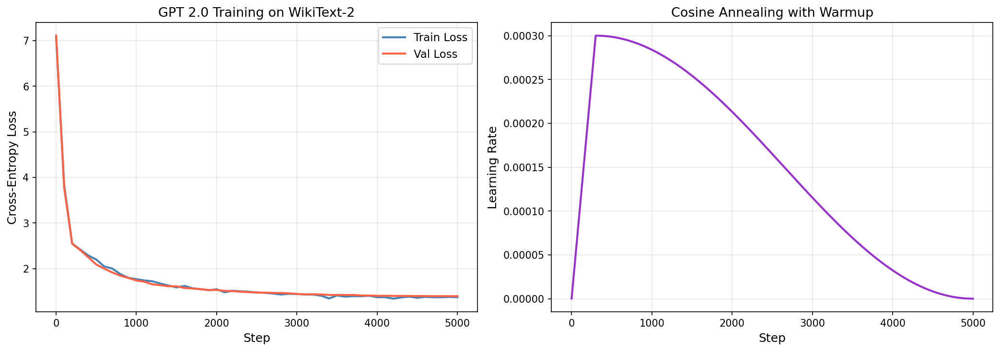

# GPT 2.0 — WikiText-2 문자 단위 언어 모델

> 수업 notebook_06 (Tiny GPT)을 발전시킨 GPT 2.0 구현.  
> 데이터셋을 **WikiText-2**로 교체하고 실제 GPT-2 논문의 핵심 기법을 적용했습니다.

---

## 수업 노트북과의 비교

| 항목 | Tiny GPT | **GPT 2.0** |
|------|------------------------|------------------------|
| 데이터셋 | Tiny Shakespeare (~1.1M chars) | **WikiText-2 (~10.9M chars)** |
| 활성화 함수 | ReLU | **GELU** |
| Weight Tying | ✗ | **✓ (embedding = lm_head)** |
| LR 스케줄 | 고정 lr | **Cosine Annealing + Warmup** |
| Gradient Clipping | ✗ | **✓ (max_norm=1.0)** |
| 모델 크기 | emb=128, heads=4, layers=4 | **emb=256, heads=8, layers=6** |
| 샘플링 | Softmax | **Temperature + Top-k** |

---

## 데이터셋: WikiText-2

**WikiText-2** (Merity et al., 2016)는 Wikipedia 영어 기사로 구성된 표준 언어 모델 벤치마크입니다.

| Split | 문자 수 |
|-------|---------|
| Train | 10,916,756 |
| Validation | 1,144,610 |
| Test | 1,288,512 |
| Vocabulary size | 1,153 |

Shakespeare의 희곡 텍스트와 달리, 백과사전 문체의 다양한 주제를 다룹니다.

---

## 학습 결과

**환경:** NVIDIA GeForce RTX 3060 Laptop GPU / PyTorch 2.5.1+cu121

| Step | Train Loss | Val Loss |
|------|-----------|---------|
| 0 | 7.11 | 7.11 |
| 500 | 2.20 | 2.09 |
| 1000 | 1.77 | 1.74 |
| 2000 | 1.55 | 1.53 |
| 3000 | 1.44 | 1.45 |
| 4000 | 1.37 | 1.40 |
| **5000** | **1.3727** | **1.3959** |



### 생성 텍스트 샘플 (temperature=0.8, top_k=40)

**프롬프트:** `"The history of "`
```
The history of the U.S. Light . The United States also had not forced on 29 inches
of March 1963 . He was said to appear to appear the Book of Andrew Marin to the large
Egyptian R @-@ Richmond Parliament , and his action .
```

**프롬프트:** `"The researchers found that "`
```
The researchers found that the village was in 1903 . Many Synan at Students for the
1900s , the intelligence was originally recorded to increase the first production of
Virginia .
```

> `@-@` 표기는 WikiText-2 데이터셋이 하이픈(-)을 `@-@`로 인코딩하는 방식에서 비롯됩니다.

---

## GPT 2.0 개선 사항

### 1. GELU 활성화 함수

실제 GPT-2 논문(Radford et al., 2019)에서 ReLU 대신 GELU를 사용합니다.

```
GELU(x) ≈ 0.5x · (1 + tanh[√(2/π) · (x + 0.044715x³)])
```

ReLU의 "dying neuron" 문제를 완화하고, smooth한 gradient를 제공합니다.

### 2. Weight Tying

토큰 embedding 행렬과 출력 projection의 가중치를 공유합니다.

```python
self.lm_head.weight = self.token_embedding.weight
```

Press & Wolf (2017)이 제안한 기법으로 파라미터 효율성을 높입니다.

### 3. Cosine Annealing + Linear Warmup

```python
if step < warmup_steps:
    lr = max_lr * step / warmup_steps
else:
    lr = max_lr * 0.5 * (1 + cos(π * progress))
```

학습 초반 gradient 폭발을 방지하고, 후반부 세밀한 수렴을 유도합니다.

### 4. Gradient Clipping

```python
nn.utils.clip_grad_norm_(model.parameters(), 1.0)
```

Gradient norm이 1.0을 초과하면 비율적으로 축소합니다.

### 5. Temperature + Top-k Sampling

- `temperature < 1.0`: 분포 집중 → 보수적 생성
- `temperature > 1.0`: 분포 평탄화 → 창의적 생성
- `top_k=40`: 상위 40개 토큰만 후보로 사용

---

## 모델 아키텍처

```
GPT2 (파라미터 수: 5,062,400)
  token_embedding:    Embedding(1153, 256)
  position_embedding: Embedding(128, 256)
  drop:               Dropout(0.1)
  blocks × 6:
    Block(
      ln1:  LayerNorm(256)
      sa:   MultiHeadAttention(8 heads, head_size=32)
      ln2:  LayerNorm(256)
      ffwd: FeedForward(256 → 1024 → 256, GELU)
    )
  ln_f:    LayerNorm(256)
  lm_head: Linear(256, 1153)  ← weight tied to token_embedding
```

---

## 실행 방법

```bash
pip install torch datasets matplotlib

# 학습
python train_gpt2.py

# 텍스트 생성 (인터랙티브)
python chat_gpt2.py
```

> 중간에 학습이 중단되어도 500 스텝마다 `checkpoint.pt`가 저장되어 자동으로 이어서 학습됩니다.

---

## 학습 하이퍼파라미터

| 파라미터 | 값 |
|----------|-----|
| block_size | 128 |
| batch_size | 128 |
| emb_dim | 256 |
| num_heads | 8 |
| num_layers | 6 |
| dropout | 0.1 |
| max_steps | 5,000 |
| max_lr | 3e-4 |
| warmup_steps | 300 |
| optimizer | AdamW (β₁=0.9, β₂=0.95, wd=0.1) |
| grad_clip | 1.0 |

---


## 참고 문헌

- Radford, A., et al. (2019). *Language Models are Unsupervised Multitask Learners.* (GPT-2)
- Merity, S., et al. (2016). *Pointer Sentinel Mixture Models.* (WikiText-2)
- Press, O., & Wolf, L. (2017). *Using the Output Embedding to Improve Language Models.* (Weight Tying)
- Karpathy, A. (2022). *Let's build GPT: from scratch, in code, spelled out.* (수업 기반 자료)

---

## 연락처

hyechul1238@yonsei.ac.kr
